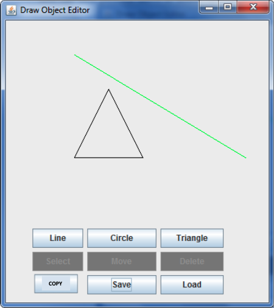
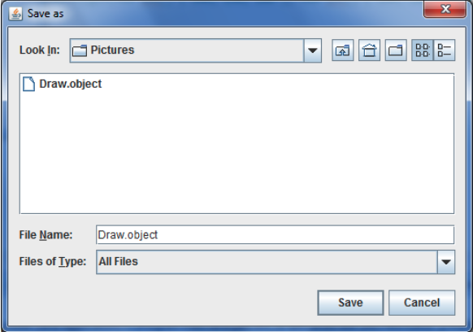

# Draw The Shape

A java app to draw lines, circles and triangles

## Basic functionalities 
* Draw line		
* Draw triangle		
* Draw circle			
* Move shape		
* Delete shape		
* Copy shape		
* Save shape		
* Load shape		

## Screenshots

