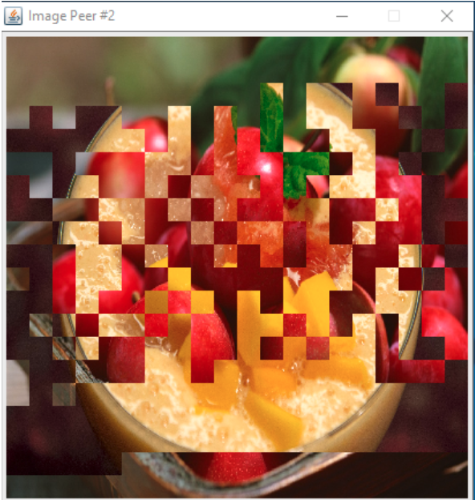

# P2P Image Sharing

Peer-to-peer image sharing local emulation on Java

## Basic functionalities 
* User login and logout
* Select an image		
* Image will be shared using P2P protocol when multiple users are logged in

## Setup
Create two different Java projects for each Server and Client  
Add JSON module to the build path of Server Java project  
Server/User.txt contains the information of the users
Run the only server program first before running multiple client programs

## Screenshots

